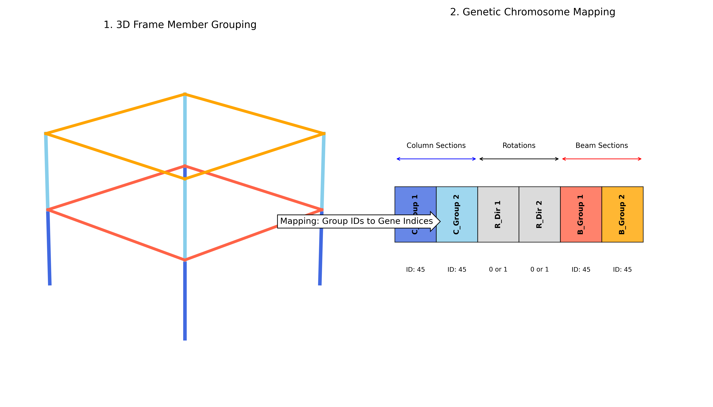
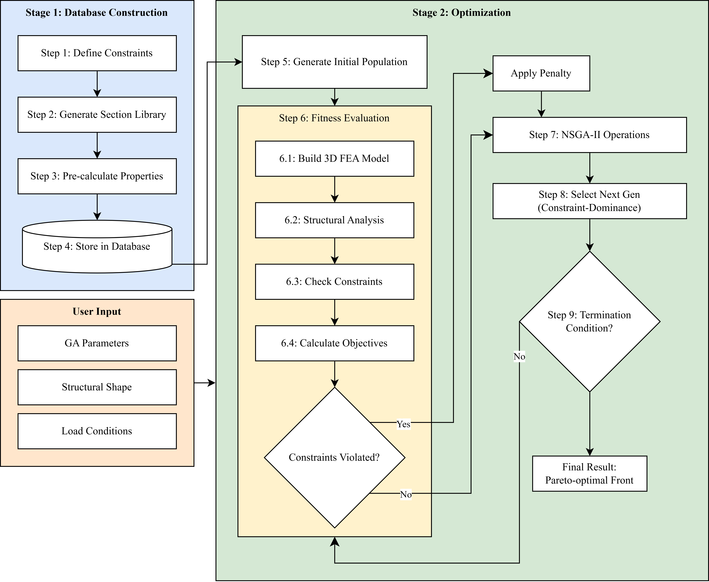
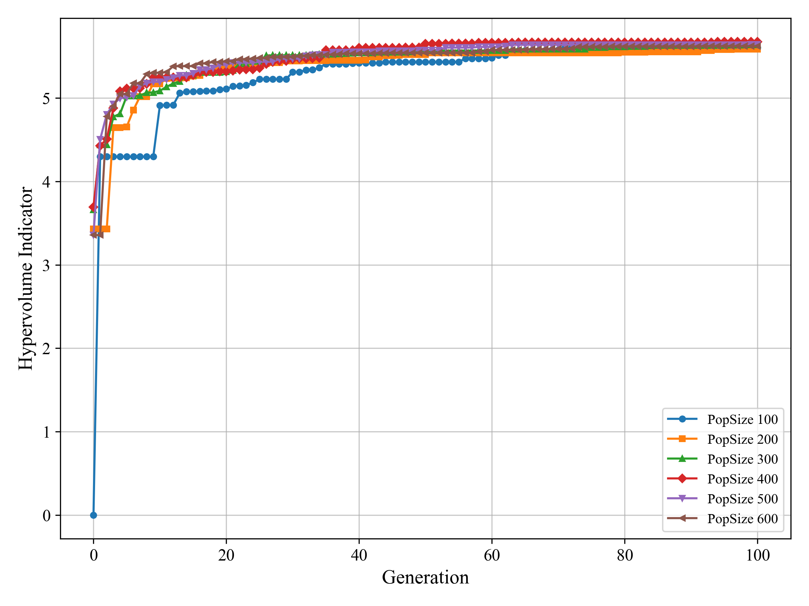
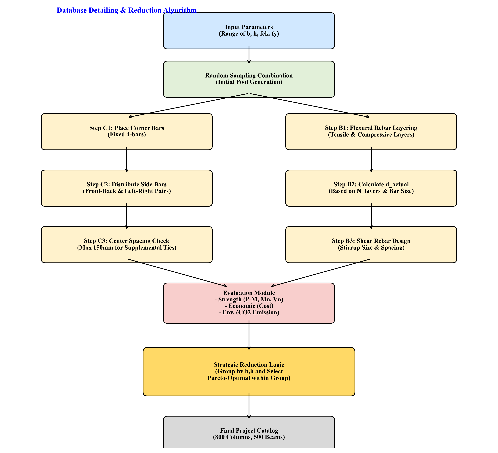
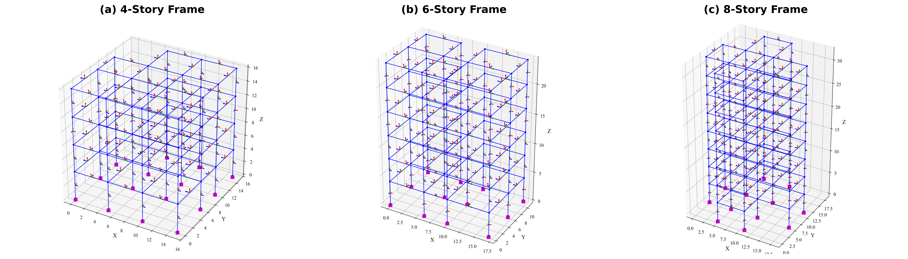
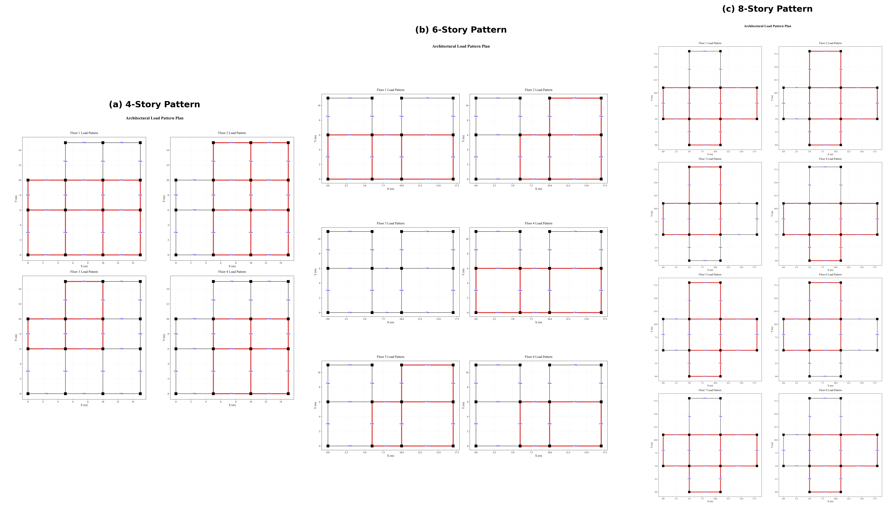
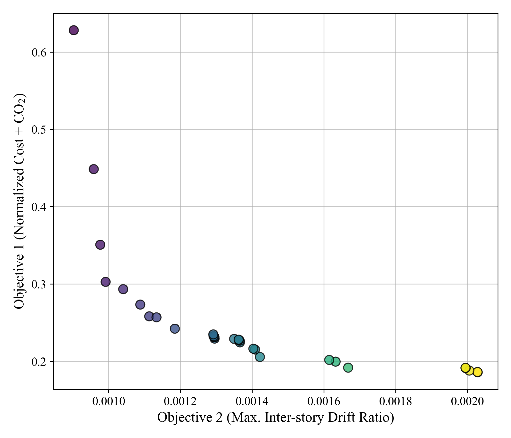
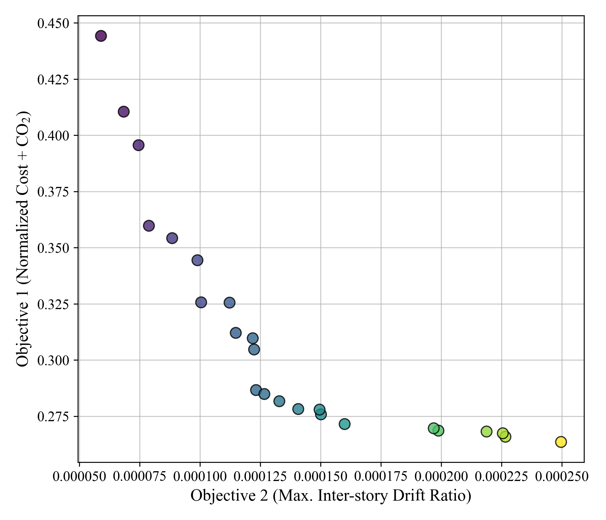
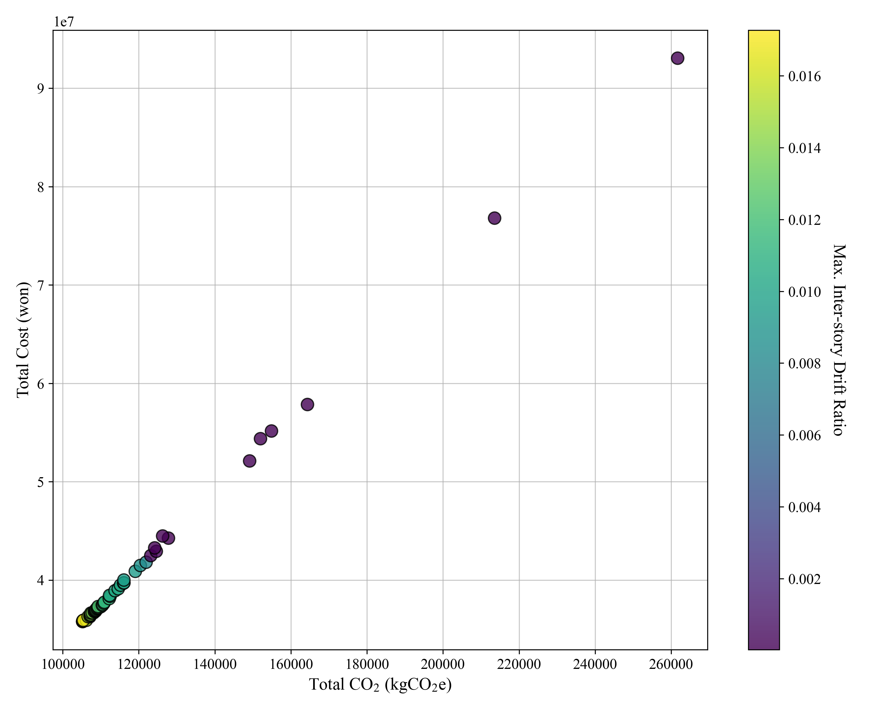
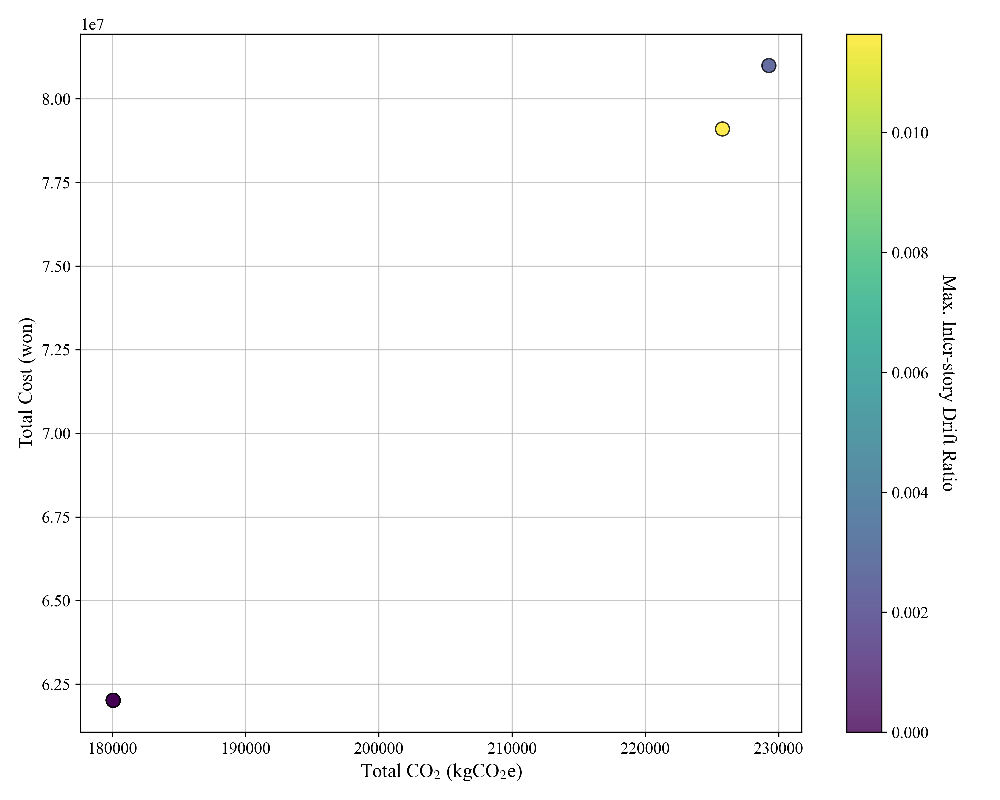

# Practical Multi-Objective Optimal Design of 3D Reinforced Concrete Moment Frames Using NSGA-II: Considering Reinforcement Detailing and Column Rotation Angles Based on a Section Database

## 1. Introduction

철근콘크리트(Reinforced Concrete, 이하 RC) 모멘트 골조는 우수한 구조적 강성과 경제적 효율성으로 인해 현대 건축물의 핵심적인 구조 시스템으로 널리 활용되고 있다. 그러나 도시화에 따른 건축물의 고층화 및 비정형화 추세는 구조 설계 단계에서 공사비 절감과 구조적 안전성 확보라는 상충하는 목적(Conflicting objectives) 사이의 최적 균형점을 찾는 과정을 더욱 복잡하게 만들고 있다 (Ehrgott, 2012; Esfandiary et al., 2016; Marler & Arora, 2004). 전통적인 설계 방식은 엔지니어의 경험적 판단에 의존하여 안전 측 설계를 수행한 후 반복적인 수정을 거치는 과정을 따르지만, 이는 수많은 설계 변수가 존재하는 3차원 공간에서 전역 최적해(Global optimum)를 보장하기에는 명확한 한계가 존재한다.

최근 유전 알고리즘(Genetic Algorithms) 및 파티클 스웜 최적화(PSO)와 같은 메타heuristic 최적화 기법이 구조 공학 분야에 도입되면서 이러한 한계를 극복하려는 노력이 지속되고 있다 (Aga & Adam, 2015; Akin & Saka, 2015; Aslay et al., 2024; Chutani & Singh, 2018; Kaveh & Sabzi, 2011; Govindaraj & Ramasamy, 2005; Babaei & Mollayi, 2016; Chaudhuri et al., 2021; Dehnavipour et al., 2019). 특히 NSGA-II(Non-dominated Sorting Genetic Algorithm II)는 다중목적 최적화 문제에서 파레토 최적해(Pareto Front)를 효율적으로 도출할 수 있는 강력한 알고리즘으로 평가받고 있다 (Deb et al., 2002; Nebro et al., 2022; Zitzler & Thiele, 2002; Coello, 2006). 그럼에도 불구하고 기존의 RC 구조 최적화 연구들은 실제 실무 적용 측면에서 몇 가지 유의미한 한계점을 지니고 있다.

기존 연구의 상당수는 2차원(2D) 프레임 모델에 국한되어 설계 변수를 최적화하는 데 그치고 있다. 실제 건축물은 3차원 공간에서 거동하며, 횡력에 의한 비틀림 및 기둥의 방향성에 따른 강성 변화가 전체 구조 시스템의 효율성에 결정적인 영향을 미친다. 또한, 설계 변수로서의 단면을 정방형으로 단순화하거나 기둥의 강축 방향을 임의로 고정함으로써, 직사각형 단면의 장단축 비율 조절 및 기둥 회전을 통한 구조적 최적화 기회를 원천적으로 차단하는 경우가 많았다 (Esfandiari et al., 2018; Kaveh & Ardebili, 2023a, 2023b; Mergos, 2021, 2022; Bekdaş & Nigdeli, 2014; Djedoui et al., 2025; Faghirnejad, 2023; Gharehbaghi, 2012; Heydari et al., 2025; Juliani & Gomes, 2021; Kaveh & Ardebili, 2021). 마지막으로, 공사비 산정 모델이 지나치게 단순화되어 실무 설계 기준에서 요구하는 보조 대근, 표피 철근, 내진 상세 갈고리 등을 반영하지 못함으로써 최적화 결과와 실제 시공 물량 사이의 상당한 괴리를 발생시켜 왔다 (Boscardin et al., 2019; Kaveh et al., 2020a; Bai et al., 2020).

본 연구에서는 이러한 연구 공백을 메우기 위해 실무 구조 설계에 즉각적으로 적용 가능한 '3차원 RC 프레임 전용 실무형 다중목적 최적화 프레임워크'를 제안한다. 본 연구의 차별화된 독창성은 직사각형 단면 조합과 양방향 및 일방향 배근 패턴, 그리고 표피 철근 및 보조 대근 자동 배치 로직을 포함한 정밀 데이터베이스를 설계 변수로 활용하였다는 점에 있다. 또한, 층별 용도 차이에 따른 활하중 변화와 체커보드 패턴의 불균형 하중 재하 등 실무적인 설계 조건을 반영할 때 발생하는 방향별 강성 요구 조건의 차이를 효율적으로 해결하기 위해, 기둥의 강축 방향을 결정하는 이진 회전 변수를 도입하였다. 이를 통해 알고리즘이 각 층의 국부적인 하중 상태에 따라 최적의 부재 방향성을 능동적으로 탐색하도록 유도하였으며, ACI 318-19 내진 상세를 엄격히 준수한 정밀 물량 산출 엔진을 구축하여 경제성 평가의 신뢰도를 확보하였다 (Kaveh et al., 2020b; Mergos, 2024; Oluwole Akadiri & Olaniran Fadiya, 2013; Paya-Zaforteza et al., 2009; Werner & Burns, 2012).

## 2. Problem Formulation

### 2.1 Design Variables and Chromosome Structure

본 연구에서는 연속 변수 대신 실무적으로 제작 가능한 이산적 단면들의 집합인 데이터베이스 인덱스를 설계 변수로 채택한다. 특히, 방대한 3차원 프레임의 탐색 공간을 효율적으로 제어하고 시공성을 확보하기 위해, 부재의 층별 위치와 평면상의 기하학적 배치를 통합적으로 고려한 그룹화 전략을 도입한다. 전체 설계 변수 벡터 $X$는 다음과 같이 정의된다.

$$
X = [\{C_{id}\}_n, \{R_{dir}\}_n, \{B_{id}\}_m]^T
$$

여기서 $C_{id}$는 기둥 단면 데이터베이스의 인덱스, $R_{dir}$은 기둥의 회전 여부를 결정하는 이진 변수(0: 0°, 1: 90°), $B_{id}$는 보 단면 데이터베이스의 인덱스를 의미한다.

Figure 1(a)에 도식화된 바와 같이, 각 부재 그룹은 건물의 높이(층)와 수평면상의 하중 분담 특성에 따라 다음과 같이 계층적으로 분류된다.

* **기둥 그룹(Column Groups):** 각 층의 기둥을 평면상의 위치에 따라 코너 기둥(Corner), 외곽 기둥(Edge), 내부 기둥(Interior)의 세 가지 유형으로 분류한다. 이는 2축 휨과 축력의 비중이 위치에 따라 상이한 물리적 하중 상태를 최적화 과정에 정밀하게 반영하기 위함이다.
* **보 그룹(Beam Groups):** 평면 외곽에 위치하여 슬래브 하중을 일방향으로 지지하는 외곽 보(Exterior)와 내부에서 양방향 하중을 지지하는 내부 보(Interior)로 이원화하여 관리한다.

이러한 전략을 통해 각 층의 국부적인 하중 불균형에 능동적으로 대응하면서도, 전체 설계 변수의 수를 최적화에 적합한 수준으로 유지하여 알고리즘의 탐색 효율을 극대화한다. Figure 1(b)는 이러한 물리적 그룹핑이 유전 알고리즘의 염색체 구조로 어떻게 매핑되는지를 보여준다. 각 그룹별로 할당되는 단면 데이터베이스의 상세한 구성 범위와 생성 로직은 4.1절에서 상세히 기술한다.

**Figure 1. Mapping mechanism from 3D frame member grouping to the genetic chromosome structure: (a) Grouping strategy based on member positions (Corner, Edge, Interior), and (b) corresponding layout of design variables in the chromosome.**

### 2.2 Objective Functions

첫 번째 목적 함수($f_1$)는 경제성과 환경성을 통합적으로 평가하기 위한 지표이다. 본 연구에서는 총 공사비($Cost$)와 탄소 배출량($CO_2$)이 모두 사용 재료량에 직접적으로 비례하는 높은 상관관계를 가진다는 점에 착안하여, 두 지표를 별도의 가중치 없이 통합하여 최소화한다. 다만, 데이터베이스에 정의된 각 단면의 고유 공사비(KRW)와 탄소 배출량(kg)은 수치적 단위와 변동 스케일이 상이하므로, 이를 동일한 비중으로 통합하기 위해 각각의 지표를 설계 공간 내의 최솟값과 최대값으로 정규화하여 합산한다. 첫 번째 목적 함수 $f_1$은 다음과 같이 정의된다.

$$
\min f_1(X) = \frac{Cost(X) - C_{min}}{C_{max} - C_{min}} + \frac{CO_2(X) - E_{min}}{E_{max} - E_{min}}
$$

여기서 $C_{min}$, $C_{max}$, $E_{min}$, $E_{max}$는 각각 전체 설계 공간 내에서의 공사비와 이산화탄소 배출량의 최소 및 최대 범위를 의미한다. 전체 부재 수 $N$에 대한 총 공사비 $Cost(X)$와 총 탄소 배출량 $CO_2(X)$는 다음과 같이 개별 부재 물량의 합산으로 산출된다.

$$
Cost(X) = \sum_{k=1}^{N} \left( C_{conc} V_{c,k} + C_{steel} W_{s,k} + C_{form} A_{f,k} \right)
$$

$$
CO_2(X) = \sum_{k=1}^{N} \left( E_{conc} (\gamma_c V_{c,k}) + E_{steel} (W_{s,k} \times 10^3) + E_{form} A_{f,k} \right)
$$

이 식에서 $V_{c,k}$는 $k$번째 부재의 콘크리트 순 부피($m^3$), $W_{s,k}$는 철근 중량($ton$), $A_{f,k}$는 거푸집 설치 면적($m^2$)을 의미한다. $\gamma_c$는 콘크리트의 단위 중량($2,400 \, kg/m^3$)이다. $C$와 $E$는 각각 해당 재료의 단위 비용 및 탄소 배출 계수이며, 산출에 사용된 상세 파라미터는 Table 1에 정리하였다.

**Table 1. Material properties, unit costs, and CO2 emission factors.**

| Material / Item              | Unit cost ($C$) | CO2 factor ($E$) |     Unit ($C$ / $E$)     |
| :--------------------------- | :---------------: | :----------------: | :---------------------------: |
| Concrete ($f_{ck}=27$ MPa) |      80,000      |        0.15        | KRW/$m^3$ / $kgCO_2e/kg$ |
| Steel Reinforcement          |     1,000,000     |        1.99        | KRW/$ton$ / $kgCO_2e/kg$ |
| Formwork                     |      25,000      |        10.0        | KRW/$m^2$ / $kgCO_2e/m^2$ |

두 번째 목적 함수($f_2$)는 구조적 서비스 가능성을 평가하기 위한 지표로, 횡력에 대한 구조물의 저항 성능을 극대화하기 위해 전체 층에서 발생하는 최대 층간변위비(Maximum Story Drift Ratio)를 최소화한다. 본 연구에서는 제1목적 함수와의 수치적 스케일 균형을 맞추어 알고리즘의 탐색 효율을 극대화하기 위해, 최대 층간변위비를 허용 한계치인 $\theta_{all}$로 정규화하여 다음과 같이 정의하였다.

$$
\min f_2(X) = \frac{\max \left( \frac{\Delta_{i,j,k}}{H_k} \right)}{\theta_{all}}
$$

여기서 $\Delta_{i,j,k}$는 $k$층의 $j$노드에서 발생하는 $i$방향의 층간변위를 나타내며, $H_k$는 해당 층의 층고를 의미한다. $\theta_{all}$은 ASCE 7-16에 따른 허용 층간변위비($0.020$ rad)이다. $f_2$ 값이 1.0에 도달하면 설계 기준에서 허용하는 최대 변위에 도달했음을 의미한다. 예제 구조물에 적용된 구체적인 하중 조건 및 모델링 파라미터는 **Appendix A**에 기술하였다.

### 2.3 Constraints

설계안의 실무적 타당성을 확보하기 위해 강도, 사용성, 그리고 계층 구조 제약 조건을 엄격히 적용한다. 본 연구에서는 기존 연구에서 간과되기 쉬운 강한 기둥-약한 보(SCWB) 설계 원칙과 풍하중에 의한 최상층 변위 제약을 포함하여 실무적 완성도를 높였다. 고려한 주요 제약 조건의 상세 기준과 이를 최적화 알고리즘에 적용하기 위한 수학적 수식($g_i(X) \le 0$)은 Table 2에 정리하였다. 모든 제약 조건은 해당 수식의 값이 0 이하일 때 만족되는 것으로 간주하며, 이를 위반할 경우 알고리즘의 제약 조건 위반량($\sum \text{Violation}$)으로 계산되어 개체 선택에 반영된다.

**Table 2. Summary of structural design constraints expressed as $g_i(X) \le 0$.**

| Category                 | Constraint Item   | Mathematical Expression ($g_i$)                            | Criteria       | Reference |
| :----------------------- | :---------------- | :----------------------------------------------------------- | :------------- | :--------: |
| **Strength**       | Member DCR        | $g_1(X) = DCR - 1.0 \le 0$                                 | Max. DCR 1.0   | ACI 318-19 |
| **Serviceability** | Story Drift Ratio | $g_2(X) = \Delta/H - \theta_{all} \le 0$                   | Max. 2.0%      | ASCE 7-16 |
| **Serviceability** | Beam Deflection   | $g_3(X) = (\delta_{LT} + \delta_{L,imm}) - L/240 \le 0$    | Long-term + LL | ACI 318-19 |
| **Serviceability** | Wind Displacement | $g_4(X) = \Delta_{wind} / (H/400) - 1.0 \le 0$             | Max.$H/400$  | ASCE 7-16 |
| **Hierarchy**      | SCWB Ratio        | $g_5(X) = \frac{1.2 \sum M_{nb}}{\sum M_{nc}} - 1.0 \le 0$ | Strong Column  | ACI 318-19 |

개별 제약 조건 위반량은 $v_i(X) = \max(0, g_i(X))$로 계산되며, 알고리즘에서 개체의 유효성을 평가하기 위한 총 제약 조건 위반량($\Phi(X)$)은 각 제약 조건의 스케일을 정규화하여 다음과 같이 산출된다.

$$
\Phi(X) = \sum_{i=1}^{m} \frac{v_i(X)}{S_i}
$$

여기서 $m$은 전체 제약 조건의 수이며, $S_i$는 각 제약 조건별 위반량의 정규화 계수(Scaling factor)이다. 모든 제약 조건을 만족하는 개체의 경우 $\Phi(X)=0$이 된다.

## 3. Optimization Methodology

### 3.1 NSGA-II Algorithm and Constraint Handling

본 연구에서 활용한 NSGA-II는 빠른 비지배 정렬과 혼잡도 거리 계산을 통해 파레토 최적해의 수렴성과 다양성을 동시에 확보하는 기법이다. 특히 RC 프레임 설계와 같이 **방대한 이산적 검색 공간(Discrete search space)**과 **수치 해석을 통해서만 확인 가능한 제약 조건**이 복합적으로 존재하는 문제에서 유효한 설계안을 우선적으로 탐색하기 위해 제약 조건 우선 지배(Constrained Dominance) 원칙을 적용하였다. 이 원칙에 따라 두 개체 $X_1$과 $X_2$ 사이의 지배 관계는 개체의 유효성 여부와 총 제약 조건 위반량($\Phi(X)$)을 기준으로 다음과 같이 결정된다:

1) $X_1$은 유효하고($\Phi(X_1)=0$) $X_2$는 유효하지 않은 경우($\Phi(X_2)>0$), $X_1$이 지배한다.
2) 둘 다 유효하지 않은 경우, 위반량이 더 작은 개체($\Phi(X_1) < \Phi(X_2)$)가 지배한다.
3) 둘 다 유효한 경우, 일반적인 파레토 지배 원칙(목적 함수 값 비교)을 따른다.

이러한 메커니즘은 알고리즘이 초기 탐색 단계에서 유효한 설계 영역으로 빠르게 수렴하도록 유도하며, 대규모 다중목적 최적화 문제에서의 효율성이 입증된 바 있다 (Zavala et al., 2016). 전체적인 최적화 프로세스는 Figure 2의 플로우차트에 도식화하였다.

**Figure 2. Flowchart of the proposed 3D RC frame optimization framework.**

### 3.2 Parametric Study of Algorithm Parameters

본 연구에서는 NSGA-II 알고리즘의 탐색 효율성과 수렴 성능을 극대화하기 위해, 하이퍼볼륨(Hypervolume, 이하 HV) 지표를 기준으로 5단계 순차적 매개변수 연구(Sequential Parametric Study)를 수행하였다. 각 단계에서는 이전 단계에서 도출된 최적 파라미터를 고정한 상태에서 다음 변수를 최적화하는 방식을 채택하여 변수 간의 상호작용을 고려하였다.

우선, 교배 전략에 따른 수렴 성능을 비교하기 위해 One-Point, Two-Point, Uniform Crossover를 대상으로 실험을 진행하였다. 분석 결과, Uniform Crossover가 초기 탐색 단계부터 가장 가파른 HV 향상을 보였으며, 최종 HV 값 역시 약 5.55를 기록하여 타 전략(One-Point: 5.26, Two-Point: 5.27) 대비 우수한 성능을 입증하였다(Figure 3a). 이는 3차원 프레임의 복잡한 염색체 구조에서 유전자의 위치와 상관없이 우수한 형질을 조합하는 데 Uniform 방식이 유리함을 시사한다.

이어서 부모 개체 선택의 압력을 조절하는 토너먼트 크기를 2부터 11까지 변화시키며 실험한 결과, 크기가 3일 때 탐색의 다양성과 수렴 속도 사이에서 최적의 균형을 보였다. 실험 데이터에 따르면 지나치게 큰 토너먼트 크기는 특정 우수 개체로의 쏠림 현상을 야기하여 조기 수렴(Premature convergence)을 유발하고, 결과적으로 최종 해의 다양성을 저해하는 것으로 나타났다(Figure 3b).

알고리즘의 탐색 강도를 결정하는 교배 확률($P_c$)과 변이 확률($P_m$)의 최적 조합을 찾기 위해 각각 0.5에서 1.0까지의 범위를 설정하여 분석하였다. 실험 결과, 높은 교차 확률($P_c=0.9$)과 상대적으로 높은 변이 확률($P_m=0.7$)의 조합에서 가장 넓은 파레토 프런트와 높은 HV 지표를 확보할 수 있었다. 특히 본 연구와 같이 이산적 단면 인덱스를 다루는 문제에서는 높은 변이 확률이 국부 최적점(Local optima)을 탈출하고 설계 공간의 전역적 탐색을 수행하는 데 결정적인 역할을 수행함을 확인하였다(Figure 3c, 3d).

마지막으로 알고리즘의 전역 탐색 성능과 연산 비용을 결정하는 개체군 크기를 100에서 1000까지 변화시키며 실험하였다. 개체군 크기가 증가함에 따라 HV 지표는 전반적으로 상승하는 경향을 보였으나, 500개체 이상에서는 지표의 향상 폭이 점차 둔화되는 양상을 보였다. 이에 따라 연산 효율성과 해의 품질 사이의 수렴성을 고려하여, HV 지표가 약 5.817로 안정화되는 시점인 개체군 크기 500을 최종 최적 값으로 채택하였다(Figure 3e).

**Figure 3. Sequential parameter optimization results: (a) Crossover Strategy, (b) Tournament Size, (c) Crossover Probability, (d) Mutation Probability, and (e) Population Size.**

## 4. Practical Section Database and Numerical Analysis Framework

### 4.1 Project-Specific Structural Section Database Construction

본 연구의 최적화 프레임워크는 구조물의 요구 성능과 건축적 제약을 반영한 '프로젝트 맞춤형 단면 데이터베이스(Project-specific Database)' 구축에서 시작된다. 이 데이터베이스는 설계자가 정의한 탐색 범위 내에서 구조적으로 유효한 이산 단면 후보군을 생성하며, 각 단면은 Figure 4의 상세 설계 로직과 수치 해석 엔진을 통해 성능 및 경제성 지표를 부여받는다. 주요 설계 변수와 생성 범위는 Table 3에 정리하였다.

상세 설계 단계에서 기둥과 보의 배근 로직은 실무 설계 지침과 ACI 318-19 규정을 반영하여 다음과 같은 통합적인 프로세스로 수행된다.

* **Column detailing (Steps C1-C3):** 기둥 단면은 4개의 코너 철근 배치를 시작으로, 목표 철근비에 맞춰 전·후면 및 좌·우측 면에 주철근을 쌍(Pair)으로 추가 분배한다. 이 과정에서 하중의 특성과 단면 형상에 따라 철근이 특정 축에 집중되는 **일방향(Uniaxial) 배근** 또는 모든 면에 균등하게 배치되는 **양방향(Biaxial) 배근** 패턴이 생성된다. 주철근의 순간격이 규정치를 초과할 경우 보조 대근(Crossties)을 자동으로 배치하여 횡구속 성능을 확보하며, 변형률 적합 조건(Strain compatibility)을 기반으로 강축과 약축 방향의 $P-M$ 상관도 해석을 수행하여 단면 성능을 정량화한다.
* **Beam detailing (Steps B1-B3):** 보 단면은 설계 모멘트 요구량에 따라 인장 및 압축 철근의 기여도를 정밀하게 고려하는 **복근보(Doubly reinforced beam)** 이론을 기반으로 설계된다. 이는 내진 골조의 연성(Ductility) 확보와 실무적인 배근 관행을 반영하기 위함이며, 철근의 다층 배치 시 발생하는 순간격 변화와 실제 유효 깊이($d$)를 실시간으로 갱신하여 휨 내력($M_n$) 산정의 정밀도를 확보한다. 전단 강도는 콘크리트 전단 기여분과 스터럽의 기여분을 합산하여 산출하며, 스터럽 간격은 규정된 최대 제한치를 엄격히 준수하도록 설계하였다.

생성된 모든 단면은 단위 길이(1m)당 공사비와 탄소 배출량을 자동으로 산출한다. 탄소 배출량은 재료별 내재탄소 배출계수(ECF)와 단위 중량을 결합한 질량 기반 산정 방식을 적용하여 신뢰도를 높였으며, 구조 해석 모델의 하중 데이터로 활용하기 위해 각 단면의 단위 중량(UnitWeight)을 함께 도출한다.

**Table 3. Definition of Discrete Search Space and User-Defined Ranges for Database Generation.**

| Parameter / Item                 | **Beam Section**     | **Column Section**     | **Note**          |
| :------------------------------- | :------------------------- | :--------------------------- | :---------------------- |
| **Width** ($b, B$)       | 300, 400, 500 mm           | 600 ~ 1000 mm (50 mm step)   | Geometrical constraints |
| **Height** ($h, H$)      | 500 ~ 800 mm (50 mm step)  | $B \sim 1.5B$ (50 mm step) | Rectangularity ratio    |
| **Concrete** ($f_{ck}$)  | 24, 27, 30 MPa             | 27, 30, 35, 40 MPa           | Member-specific grades  |
| **Main Rebar**             | D16, D22                   | D25, D29, D32                | SD400, SD500            |
| **Rebar Ratio** ($\rho$) | 0.5% ~ 4.5%                | 1.0% ~ 8.0%                  | ACI 318-19              |
| **Stirrup Size**           | D10, D13                   | D10, D13                     | Transverse rebar        |
| **Stirrup Spacing**        | 100 ~$0.5d$ (max 600 mm) | 100 ~ 150 mm                 | ACI Seismic detailing   |
| **Steel** ($f_y$)        | 400, 500 MPa               | 400, 500 MPa                 | Main reinforcement      |
| **Aggregate Size**         | 25 mm                      | 25 mm                        | For spacing/cover       |

데이터베이스 구축의 최종 단계에서는 Pareto 기반의 지능형 설계 공간 감축(Smart search space reduction) 로직을 수행한다. 동일한 기하 규격을 가진 단면 후보군 내에서 공사비 대비 구조 성능(기둥: $P-M$ 상관도 체적, 보: 휨 내력)이 열등한 비효율적 단면들을 사전에 필터링함으로써, 최적화 알고리즘의 탐색 효율을 극대화하고 전체적인 연산 비용을 절감한다.

**Figure 4. Detailed flowchart of the structural section detailing logic and Pareto-based reduction process.**

### 4.2 Automated Structural Analysis using OpenSees

전체 최적화 프레임워크는 Python 기반의 DEAP 라이브러리와 범용 구조 해석 엔진인 OpenSees를 연동하여 구현되었다 (Mazzoni et al., 2006). 알고리즘에 의해 생성된 개별 설계 변수 조합은 수치 해석 모델로 자동 변환되며, OpenSees를 통해 각 설계안의 구조적 성능이 평가된다.

본 연구에서는 실제적인 3차원 거동을 모사하기 위해 P-Delta 효과와 강체 횡경막 가정을 포함한 정밀 해석 모델을 구축하였으며, ACI 318-19 및 ASCE 7-16 규정에 따른 하중 조합 및 사용성 검토를 수행하였다. 특히, 건물의 용도 및 층별 특성을 정밀하게 반영하기 위해 하부 로비 및 근린생활시설(1-2층)에는 $5.0 \, \text{kN/m}^2$, 중층부 사무 공간(3-5층)에는 $3.0 \, \text{kN/m}^2$, 그리고 상층부 주거 및 기타 공간(6층 이상)에는 $2.0 \, \text{kN/m}^2$의 차등 활하중을 정량적으로 적용하였다. 이러한 층별 하중의 차이와 Figure 6에 도식화된 체커보드 패턴의 하중 재하 시나리오는 각 층의 부재 그룹이 처한 국부적인 응력 상태를 상이하게 만들며, 이는 설계의 실무적 신뢰성을 확보하는 핵심 요소가 된다. Figure 5는 본 연구에서 예제로 활용된 4, 6, 8층 벤치마크 구조물의 3차원 형상을 보여준다.

**Figure 5. 3D isometric views of the benchmark structures: (a) 4-story, (b) 6-story, and (c) 8-story frames.**

**Figure 6. Representative checkerboard load pattern plans for the benchmark structures: (a) 4-story, (b) 6-story, and (c) 8-story cases.**

Figure 6에 제시된 체커보드 하중 재하 방식은 실무 설계에서 건물의 용도 및 공간별 기능 차이에 따른 하중 불균형을 모사하는 데 필수적이다. 실제 건축물은 로비, 사무 공간, 기계실 등 층별 또는 구역별로 서로 다른 활하중 기준이 적용되며, 이러한 하중의 위치별 불균형은 구조물 전체에 비대칭적인 응력 분포와 특정 방향으로의 편심을 유발한다.

본 연구에서는 이러한 실무적인 하중 상태에 효과적으로 대응하기 위해, 기하학적 효율이 높은 **직사각형 단면 조합**과 기둥의 강축 방향을 결정하는 **이진 회전 변수($R_{dir}$)**를 최적화 엔진의 핵심 요소로 도입하였다. 알고리즘은 각 부재 그룹이 처한 국부적인 응력 상태와 방향별 강성 요구 조건에 맞춰 기둥의 강축을 능동적으로 배치함으로써, 한정된 재료량 내에서 구조적 저항 성능을 극대화한다. 이는 기둥의 단면을 정방형으로 제한하거나 방향을 일률적으로 고정하는 기존의 관행적 설계 방식과 차별화되는 지점이며, 3차원 공간에서 각 층의 하중 특성에 최적화된 맞춤형 강성 분포를 형성하도록 유도하는 결정적인 장치가 된다. 해석 모델 구축을 위한 상세한 파라미터, 하중 산정 근거 및 구조 해석 가정은 논문 말미의 **Appendix A**에 상세히 기술하였다.

### 5.1 Multi-Objective Optimization Results and Representative Design Analysis

본 연구에서 제안한 최적화 프레임워크를 4층(Example 1) 및 6층(Example 2) RC 모멘트 골조 예제에 적용한 결과, 목적 함수 공간에서 명확한 파레토 프런트(Pareto Front)가 도출되었다. 모든 예제에서 총 공사비 및 탄소 배출량의 통합 정규화 지표($f_1$)와 최대 층간변위비($f_2$) 사이의 명확한 트레이드오프(Trade-off) 관계가 확인되었다. Figure 7은 각 예제에 대한 목적 함수 공간에서의 파레토 프런트 분포를 보여준다. 4층 예제(Figure 7a)의 경우, 비용 중심 설계안(Solution ID 1)은 약 3,174만 원의 공사비와 1.78%의 최대 층간변위비를 보였으나, 강성 중심 설계안(Solution ID 21)은 공사비가 약 9,301만 원까지 상승하는 대신 변위비를 0.62%까지 대폭 억제하여 구조적 성능을 약 3배가량 향상시켰다. 반면 6층 예제(Figure 7b)에서는 층수 증가에 따른 최소 강성 요구 조건으로 인해 파레토 해들이 상대적으로 좁은 비용 구간(약 4,683만 원 ~ 5,186만 원)에 밀집되는 경향을 보였다. 이는 건물의 규모가 커질수록 구조적 안전성 제약 조건이 설계 공간을 더욱 압축하며, 경제성과 성능 사이의 선택 폭이 고층화될수록 정교해짐을 시사한다. 8층 예제(Figure 7c)에 대한 결과 분석은 해석 완료 후 추가될 예정이다.

Figure 8은 각 설계안의 실제 공사비와 탄소 배출량 사이의 상관관계를 보여준다. 두 지표는 모든 예제에서 매우 강한 양의 상관관계를 보였으며, 이는 공사비와 환경 영향성을 하나의 통합 지표로 관리하는 본 연구의 방식이 실무적으로 타당함을 입증한다. 4층 예제(Figure 8a)에서는 고강성 설계로 갈수록 재료 투입량이 급격히 늘어나며 탄소 배출량이 최대 2.7배까지 증가하는 양상을 보인 반면, 6층 예제(Figure 8b)는 제한된 설계 공간 내에서 최적의 재료 분배를 통해 탄소 배출량의 변동 폭을 최소화하면서도 목표 성능을 달성하는 해들을 도출하였다. 8층 예제(Figure 8c) 역시 유사한 경향을 보일 것으로 기대된다.

**(a)**

**(b)**
**Figure 7. Multi-objective optimization results in the objective space: Pareto fronts for (a) 4-story, (b) 6-story, and (c) 8-story benchmark structures.**

**(a)**

**(b)**
**Figure 8. Distribution of Pareto solutions in the physical space (Total Cost vs. CO2): (a) 4-story, (b) 6-story, and (c) 8-story cases.**

최적화 알고리즘이 탐색한 설계 전략을 심층적으로 분석하기 위해, 4층 예제의 파레토 양 극단에 위치한 두 가지 대표 설계안(Solution ID 1, Solution ID 20)을 선정하여 비교하였다. 두 설계안의 주요 성능 지표 비교는 Table 4와 같다.

**Table 4. Performance metrics comparison for Solution ID 1 and ID 20 (4-Story).**

| Metric                                      | Solution ID 1 (Economical) | Solution ID 20 (High-Stiffness) |
| :------------------------------------------ | :------------------------: | :-----------------------------: |
| Total Cost (KRW)                            |         31,745,592         |           80,064,699           |
| Embodied CO2 (kg)                           |           98,504           |             233,385             |
| Max. Story Drift Ratio (%)                  |           1.786%           |             0.648%             |
| Objective 1 ($f_1$: Normalized Cost+CO2)  |           0.0702           |             0.8862             |
| Objective 2 ($f_2$: Normalized Max Drift) |           0.8931           |             0.3241             |

Solution 1은 제약 조건을 만족하는 범위 내에서 물량을 최소화하는 극단적인 전략을 취한다. 공사비와 탄소 배출량을 최소화하는 대신, 최대 층간변위비를 허용 한계(2.0%)에 근접한 1.786%까지 허용함으로써 경제성을 극대화하였다. 반면 Solution 20은 공사비가 약 152% 상승하고 탄소 배출량이 137% 증가함에도 불구하고, 최대 층간변위비를 0.648% 수준으로 대폭 낮추어 구조적 강성과 서비스 가능성을 비약적으로 향상시켰다. 이러한 양 극단의 해는 설계자가 프로젝트의 예산과 요구 성능에 따라 최적의 타협점을 선택할 수 있는 정량적 근거를 제공한다.

모든 예제에서 부재 DCR(Demand-Capacity Ratio)은 1.0 이하를 유지하여 구조적 안전성을 확보하였다. 특히 경제적 설계안으로 갈수록 DCR 분포가 0.7~0.9 구간으로 이동하며 재료 효율성이 극대화되는 양상이 관찰되었다. 이는 NSGA-II 알고리즘이 제약 조건 경계면(Constraint boundary)을 따라 매우 정밀하게 최적해를 탐색했음을 입증한다. 또한, 기둥 회전 변수의 도입은 특히 편심 하중이 작용하는 외곽 기둥(Edge Column)에서 두드러진 효과를 보였다. 알고리즘은 외곽 보에서 전달되는 일방향 모멘트의 방향에 맞춰 기둥의 강축을 자동 정렬함으로써 부재의 2축 휨 저항 능력을 최적화하였다. 각 솔루션의 상세 설계 변수 벡터와 배근 상세는 Appendix B에 상세히 기술하였다.

### 5.2 Comparative Analysis: Effect of Separate Column Rotation Variables

(To be rewritten based on scenario comparison results)

### 5.3 Statistical Reliability and Convergence Stability

(To be rewritten based on statistical validation results)

## 6. Conclusions

(To be rewritten based on new results)

## References

Aga, A. A., & Adam, F. M. (2015). Design optimization of reinforced concrete frames. Open Journal of Civil Engineering, 05(01), 74–83.
Akin, A., & Saka, M. P. (2015). Harmony search algorithm based optimum detailed design of reinforced concrete plane frames subject to ACI 318-05 provisions. Computers & Structures, 147, 79-95.
American Society for Civil Engineering (ASCE). (2016). Mign Loads and Associated Criteria for Buildings and Other Structures, ASCE/SEI 7-16.
Aslay, S. E., Dede, T., & Kaveh, A. (2024). Integrated design optimization process for building projects. Periodica Polytechnica Civil Engineering, 68(4), 1175-1183.
Babaei, M., & Mollayi, M. (2016). Multi-objective optimization of reinforced concrete frames using NSGA-II algorithm. Engineering Structures and Technologies, 8(4), 157-164.
BAI, J. L., CHEN, H. M., SUN, B. H., & JIN, S. S. (2020). Seismic uniform damage-targeted design of RC frame structures. Engineering Mechanics, 37(8), 179-188.
Bekdaş, L., & Nigdeli, S. M. (2014, July). Optimization of RC frame structures subjected to static loading. In 11th World Congress on Computational Mechanics (pp. 20-25).
Boscardin, J. T., Yepes, V., & Kripka, M. (2019). Optimization of reinforced concrete building frames with automated grouping of columns. Automation in Construction, 104, 331-340.
Chaudhuri, P., Barman, S., Maity, D., & Maiti, D. K. (2021). Cost effective design of RC building frame employing unified particle swarm optimization.
Chopra, A. K. (2017). Dynamics of Structures: Theory and Applications to Earthquake Engineering. Pearson.
Chutani, S., & Singh, J. (2018). Use of modified hybrid PSOGSA for optimum design of RC frame. Journal of the Chinese Institute of Engineers, 41(4), 342-352.
Coello, C. C. (2006). Evolutionary multi-objective optimization: a historical view of the field. IEEE computational intelligence magazine, 1(1), 28-36.
Deb, K., Pratap, A., Agarwal, S., & Meyarivan, T. A. M. T. (2002). A fast and elitist multiobjective genetic algorithm: NSGA-II. IEEE transactions on evolutionary computation, 6(2), 182-197.
Dehnavipour, H., Mehrabani, M., Fakhriyat, A., & Jakubczyk-Gałczyńska, A. (2019). Optimization-based design of 3D reinforced concrete structures. Journal of soft computing in civil engineering, 3(3), 95-106.
Djedoui, N., Djafar-Henni, N., Bekdaş, L., & Nigdeli, S. M. (2025). Multi-objective optimization of RC structures. Iranian Journal of Science and Technology, Transactions of Civil Engineering, 1-22.
Ehrgott, M. (2012). Vilfredo Pareto and multi-objective optimization. Doc. math, 8, 447-453.
Esfandiari, M. J., Urgessa, G. S., Sheikholarefin, S., & Manshadi, S. D. (2018). Optimum design of 3D reinforced concrete frames using DMPSO algorithm. Advances in Engineering Software, 115, 149-160.
Esfandiary, M. J., Sheikholarefin, S., & Bondarabadi, H. R. (2016). A combination of particle swarm optimization and multi-criterion decision-making for optimum design of reinforced concrete frames. International journal of optimization in civil engineering, 6(2), 245-268.
Faghirnejad, S. (2023). Performance-Based Optimization of 2D Reinforced Concrete Moment Frames through Pushover Analysis and ABC Optimization Algorithm. arXiv preprint arXiv:2312.09450.
Gharehbaghi, S. (2012). Design optimization of RC frames under earthquake loads. Iran University of Science & Technology.
Govindaraj, V., & Ramasamy, J. V. (2005). Optimum detailed design of reinforced concrete continuous beams using genetic algorithms. Computers & structures, 84(1-2), 34-48.
Heydari, F., Andalib, M., Epackachi, S., & Rafiee-Dehkharghani, R. (2025). Optimized design of RC moment frames with machine learning methods. Journal of Building Engineering, 104, 112222.
Juliani, M. A., & Gomes, W. J. D. S. (2021). Optimal configuration of RC frames considering ultimate and serviceability limit state constraints. Revista IBRACON de Estruturas e Materiais, 14(2), e14204.
Kaveh, A., & Ardebili, S. R. (2023a). Optimal design of mixed structures under time-history loading using metaheuristic algorithm. Periodica Polytechnica Civil Engineering, 67(1), 57-64.
Kaveh, A., Izadifard, R. A., & Mottaghi, L. (2020a). Cost optimization of RC frames using automated member grouping. International Journal of Optimization in Civil Engineering, 10(1), 91-100.
Kaveh, A., Izadifard, R. A., & Mottaghi, L. (2020b). Optimal design of planar RC frames considering CO2 emissions using ECBO, EVPS and PSO metaheuristic algorithms. Journal of Building Engineering, 28, 101014.
Kaveh, A., & Ardebili, S. R. (2021, December). An improved plasma generation optimization algorithm for optimal design of reinforced concrete frames under time-history loading. In Structures (Vol. 34, pp. 758-770).
Kaveh, A., & Ardebili, S. R. (2023b, February). Optimum design of 3D reinforced concrete frames using IPGO algorithm. In Structures (Vol. 48, pp. 1848-1855).
Kaveh, A., & Sabzi, O. (2011). A comparative study of two meta-heuristic algorithms for optimum design of reinforced concrete frames.
Federal Emergency Management Agency (FEMA). (2012). Seismic Performance Assessment of Buildings Volume 1-Methodology. Rep. No. FEMA P-58-1.
MacGregor, J. G., Wight, J. K., Teng, S., & Irawan, P. (1997). Reinforced concrete: Mechanics and design (Vol. 3). Upper Saddle River, NJ: Prentice Hall.
Marler, R. T., & Arora, J. S. (2004). Survey of multi-objective optimization methods for engineering. Structural and multidisciplinary optimization, 26(6), 369-395.
Mazzoni, S., McKenna, F., Scott, M. H., & Fenves, G. L. (2006). Open system for earthquake engineering simulation (opensees) opensees command language manual. Pacific Earthquake Engineering Research Center, 1-465.
McKenna, F. T. (1997). Object-oriented finite element programming: frameworks for analysis, algorithms and parallel computing. University of California, Berkeley.
Mergos, P. E. (2021). Optimum design of 3D reinforced concrete building frames with the flower pollination algorithm. Journal of Building Engineering, 44, 102935.
Mergos, P. E. (2022). Surrogate-based optimum design of 3D reinforced concrete building frames to Eurocodes. Developments in the Built Environment, 11, 100079.
Mergos, P. E. (2024). Structural design of reinforced concrete frames for minimum amount of concrete or embodied carbon. Energy and Buildings, 318, 114505.
Nebro, A. J., Galeano-Brajones, J., Luna, F., & Coello Coello, C. A. (2022). Is NSGA-II ready for large-scale multi-objective optimization?. Mathematical and Computational Applications, 27(6), 103.
Oluwole Akadiri, P., & Olaniran Fadiya, O. (2013). Empirical analysis of the determinants of environmentally sustainable practices in the UK construction industry. Construction Innovation, 13(4), 352-373.
Paya-Zaforteza, I., Yepes, V., Hospitaler, A., & Gonzalez-Vidosa, F. (2009). CO2-optimization of reinforced concrete frames by simulated annealing. Engineering Structures, 31(7), 1501-1508.
Werner, W., & Burns, J. G. (2012). Quantification and optimization of structural embodied energy and carbon. In Structures Congress 2012 (pp. 929-940).
Zavala, G., Nebro, A. J., Luna, F., & Coello Coello, C. A. (2016). Structural design using multi-objective metaheuristics. Comparative study and application to a real-world problem. Structural and Multidisciplinary Optimization, 53(3), 545-566.
Zitzler, E., & Thiele, L. (2002). Multiobjective evolutionary algorithms: a comparative case study and the strength Pareto approach. IEEE transactions on Evolutionary Computation, 3(4), 257-271.

---

## Appendix A. Structural Modeling and Loading Details

본 부록에서는 4.2절에서 언급된 수치 해석 모델의 상세 가정과 하중 산정 근거를 기술한다.

**Modeling assumptions:** 3차원 골조의 거동을 모사하기 위해 사용된 `elasticBeamColumn` 요소는 축력, 전단력, 비틀림 및 2축 휨을 모두 고려한다. 기둥 부재에는 P-Delta 기하학적 변환을 적용하여 고차 효과를 반영하였으며, 바닥판의 강체 횡경막 거동을 위해 각 층의 모든 절점은 해당 층의 마스터 절점에 대해 수평 자유도가 구속되었다. 강성 저감은 ACI 318-19를 따르며 ($0.7I_g$ for columns, $0.35I_g$ for beams), 구체적인 파라미터는 Table A1에 정리하였다.

**Loading and Seismic parameters**: 지진하중은 ASCE 7-16의 등가정적해석법을 기반으로 하며, 반응수정계수($R=5.0$)와 변위증폭계수($C_d=4.5$)를 적용하였다. 층별 지진력은 고유치 해석으로 도출된 1차 모드 형상($\phi$)에 따라 분배되었다. 활하중은 층별 용도 차이를 반영하여 로비층($5.0{\mathrm{kN/m}}^2$)부터 상층부 주거/사무 공간($2.0\sim3.0{\mathrm{kN/m}}^2$)까지 차등 적용되었다. 풍하중 산정 시에는 지표면 조도 구분 B(Exposure B)를 적용하였으며, 풍속 $30\mathrm{m/s}$에 대한 풍압 계수($C_p$)는 풍상측 0.8, 풍하측 -0.5를 사용하였다.

**Table A1. Detailed structural modeling and loading parameters for benchmark frames.**

| Category                | Parameter                        | Value / Description                                        |
| :---------------------- | :------------------------------- | :--------------------------------------------------------- |
| **Modeling**      | Element type                     | 3D elasticBeamColumn (6-DOF per node)                      |
|                         | Geometric nonlinearity           | P-Delta transformation for columns                         |
|                         | Diaphragm action                 | Rigid diaphragm (Master-Slave) at each floor               |
|                         | Effective stiffness              | $0.7 I_g$ (Columns), $0.35 I_g$ (Beams) (ACI 318-19)   |
|                         | Steel strength ($f_y$)         | $400,\ 500 MPa (E_s=200,000 MPa)$                        |
| **Gravity Load**  | Dead load (Slab + Superimposed)  | $5.0{\mathrm{kN/m}}^2$ (including 150mm slab)            |
|                         | Live load (Floor 1-2 / 3-5 / 6+) | $5.0 / 3.0 / 2.0 \, \text{kN/m}^2$                       |
|                         | Load pattern                     | Checkerboard pattern per floor                             |
| **Seismic (ELF)** | Design spectral acceleration     | $S_{DS}=0.60g$, $S_{D1}=0.36g$ (Site Class D)          |
|                         | Response / Displacement factors  | $R = 5.0$, $C_d = 4.5$, $I_e = 1.0$                  |
|                         | Force distribution               | First mode shape ($\phi$) based (Eigenvalue analysis)    |
|                         | Directional combinations         | 100% (Principal) + 30% (Orthogonal)                        |
| **Wind (MWFRS)**  | Basic wind speed ($V$)         | $30 \, \text{m/s}$ (Exposure B, ASCE 7-16)               |
|                         | Gust / Pressure coefficients     | $G = 0.85$, $C_p = 0.8$ (Windward), $-0.5$ (Leeward) |
| **Analysis**      | Total load combinations          | 38 combinations (Strength: 26, Serviceability: 12)         |

---

## Appendix B. Detailed Design Variables and Reinforcement Detailing for 4-Story Optimized Designs

본 부록에서는 5.1절에서 분석된 4층 예제의 두 가지 대표 설계안(Solution ID 1, Solution ID 20)의 전체 설계 변수 벡터(Design Variable Vector) 구성 및 부재별 상세 배근 정보를 제공한다.

### B.1 Design Variable Vector Comparison

|          Category          |    Floor    | Group / Position  | **Solution ID 1** | **Solution ID 20** |
| :-------------------------: | :----------: | :---------------- | :---------------------: | :----------------------: |
| **Column Section ID** | **1F** | Corner (Grp 0)    |            4            |           676           |
|                            |              | Edge (Grp 1)      |            7            |           747           |
|                            |              | Interior (Grp 2)  |           15           |           402           |
|                            | **2F** | Corner (Grp 3)    |           47           |           774           |
|                            |              | Edge (Grp 4)      |           28           |           692           |
|                            |              | Interior (Grp 5)  |            8            |           584           |
|                            | **3F** | Corner (Grp 6)    |           170           |           754           |
|                            |              | Edge (Grp 7)      |           11           |            52            |
|                            |              | Interior (Grp 8)  |           11           |           716           |
|                            | **4F** | Corner (Grp 9)    |           201           |           640           |
|                            |              | Edge (Grp 10)     |           157           |           473           |
|                            |              | Interior (Grp 11) |           28           |           238           |
|  **Column Rotation**  | **1F** | Corner (Grp 0)    |        1 (90°)        |         1 (90°)         |
|       (0=0°, 1=90°)       |              | Edge (Grp 1)      |        1 (90°)        |         0 (0°)         |
|                            |              | Interior (Grp 2)  |        1 (90°)        |         1 (90°)         |
|                            | **2F** | Corner (Grp 3)    |         0 (0°)         |         1 (90°)         |
|                            |              | Edge (Grp 4)      |        1 (90°)        |         0 (0°)         |
|                            |              | Interior (Grp 5)  |        1 (90°)        |         1 (90°)         |
|                            | **3F** | Corner (Grp 6)    |        1 (90°)        |         0 (0°)         |
|                            |              | Edge (Grp 7)      |         0 (0°)         |         0 (0°)         |
|                            |              | Interior (Grp 8)  |        1 (90°)        |         0 (0°)         |
|                            | **4F** | Corner (Grp 9)    |         0 (0°)         |         0 (0°)         |
|                            |              | Edge (Grp 10)     |         0 (0°)         |         1 (90°)         |
|                            |              | Interior (Grp 11) |        1 (90°)        |         0 (0°)         |
|  **Beam Section ID**  | **1F** | Exterior (Grp 0)  |           71           |           436           |
|                            |              | Interior (Grp 1)  |           27           |           351           |
|                            | **2F** | Exterior (Grp 2)  |           131           |           384           |
|                            |              | Interior (Grp 3)  |           11           |           472           |
|                            | **3F** | Exterior (Grp 4)  |           90           |           344           |
|                            |              | Interior (Grp 5)  |           27           |           398           |
|                            | **4F** | Exterior (Grp 6)  |           60           |           404           |
|                            |              | Interior (Grp 7)  |            6            |           436           |

### B.2 Reinforcement Detailing Analysis

#### Solution ID 1 (Economical Design)

* **Column Reinforcement:** 주로 최소 철근비(1.0%)에 근접한 배근이 이루어졌으며, 단면 크기를 최소화하는 대신 고강도 철근(SD500)을 활용하여 내력을 확보하였다.
* **Beam Reinforcement:** 휨 모멘트 요구량에 맞춘 정밀 복근 배근이 적용되었으며, 스터럽 간격은 전단력 분포에 따라 최적화되었다.

#### Solution ID 20 (High-Stiffness Design)

* **Column Reinforcement:** 대형 단면과 함께 고배근(2.5~4.0%)이 적용되어 횡강성을 극대화하였다. 특히 1, 2층 내부 기둥에는 연성 확보를 위한 조밀한 보조 대근 배치가 특징이다.
* **Beam Reinforcement:** 강성이 큰 단면과 함께 충분한 주철근량이 배치되어 접합부의 모멘트 재분배 능력을 높였다.
